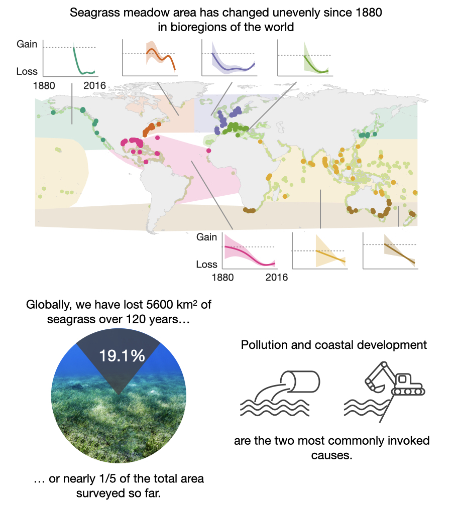

### Code and data for "Long-term declines and recovery of meadow area across the world’s seagrass bioregions"

Citation: Dunic, J. C., Brown, C. J., Connolly, R. M., Turschwell, M. P., & Côté, I. M. (2021). Long-term declines and recovery of meadow area across the world’s seagrass bioregions. *Global Change Biology*, *n/a*(n/a). https://doi.org/10.1111/gcb.15684

This repository includes the code and data used in the above paper and should reproduce all figures, tables, and supplemental figures/tables found in the paper. 

Contributors to this code base, including the use of GAMs for the reconstruction of seagrass meadow area time series: [cbrown5](https://github.com/cbrown5) and [mpturschwell](https://github.com/mpturschwell). 

## Scripts

---

### Reproduce overall results: 

**00_get-results.R**

- Sources scripts in the order required to reproduce results. 

### Load functions:

**01_functions.R**

- contains most of the key functions used in the analysis and construction of figures, some functions are still found with in scripts (originally there to aid with troubleshooting)

### Reconstruct time series and prepare data for visualisation

**02_analysis-data-prep.R**

- Applies some unit conversions, provides factor levels, applies Short et la. 2007 bioregions. 

**02_gam-interpolation.R**

- Reconstruct time series for each meadow using a GAM fit to each bioregion. A GAM was fit for the Mediterranean, but excluded 16 sites with only two sampled time points (insufficient data to fit the GAM). These sites were reconstructed using linear impuation.

**03_decadal_data_prep.R**

- Prepare the data for the rest of the analyses. Formats factors/names/colours and combines site covariates with the decadal estimates from the reconstructions in <02_gam-interpolation.R>

### Produce figures and tables

**04_bioregional_GAM_trends.R**

- Plots the bioregional GAM fits (Figure 2). 

**04_descriptive_stats.R**

- Produce some summary values referenced in text and some supplementary figures.

**04_driver-attributions.R**

- Get summary information and plot driver/attribution figures (Figure 4 & 5) in main text and supplementary information. 

**04_net-change.R**

- Calculate net change (Table 2) values and produce supplementary figures to show net change across decades. 

**04_site-map.R**

- Produce map (Figure 1) showing sites in this study, sites from Waycott et al .2009, global seagrass distribution, and Short et al. 2007 bioregions. Short bioregions were converted to a shapefile by the [GLOW](https://globalwetlandsproject.org/) team. 

**04_status_plots.R**

- Produce status plots to visualise the individual meadow variablity across bioregions (Figure 3) and supplementary status plots. 

### Produce results files

**05_Figures.Rmd**
**05_Tables.Rmd**

- Render the main text figure and tables to word documents. The figures are all created in the 04_XX.R scripts. Table 1 is contained in this script. 

### Supplementary results

**06_Supplementary_figures.Rmd**
**06_Supplementary_tables.Rmd**

- Render the supplementary figures and tables to word documents. The figures are all created in the 04_XX.R scripts.

